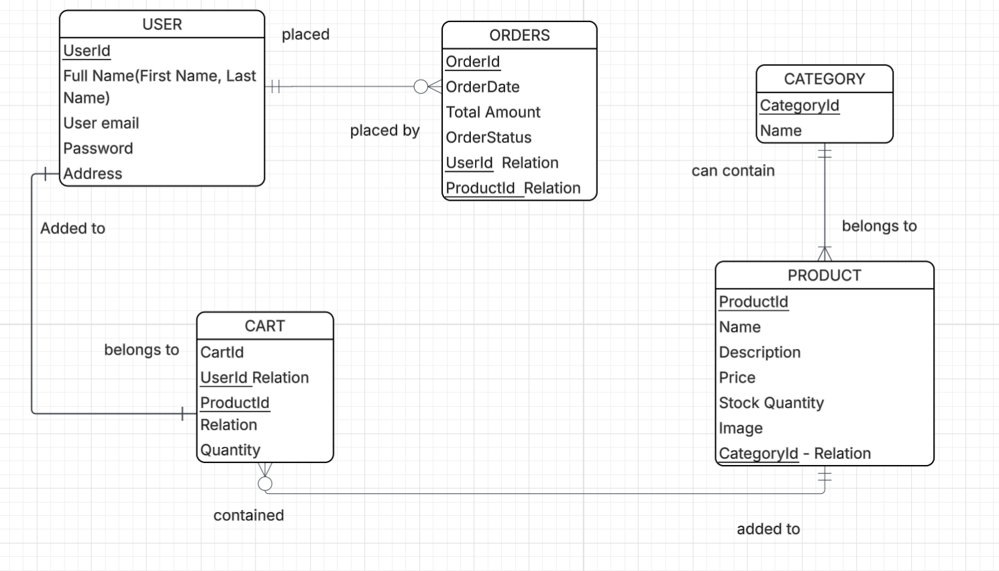
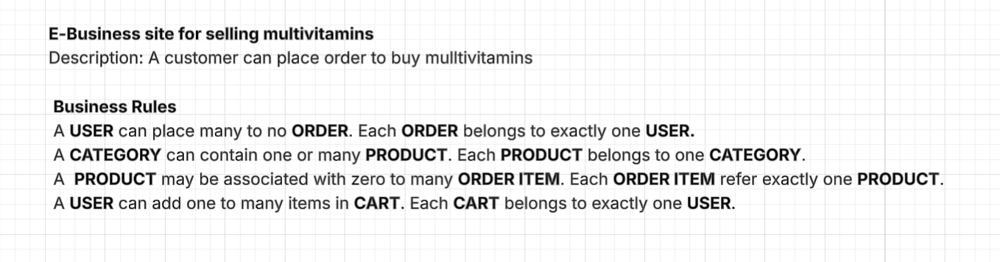
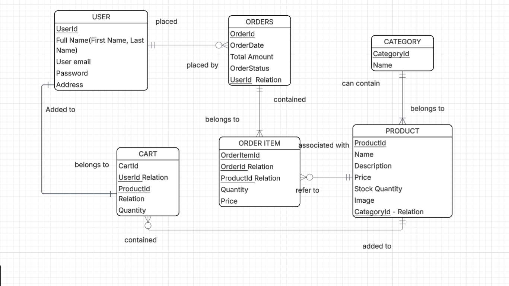
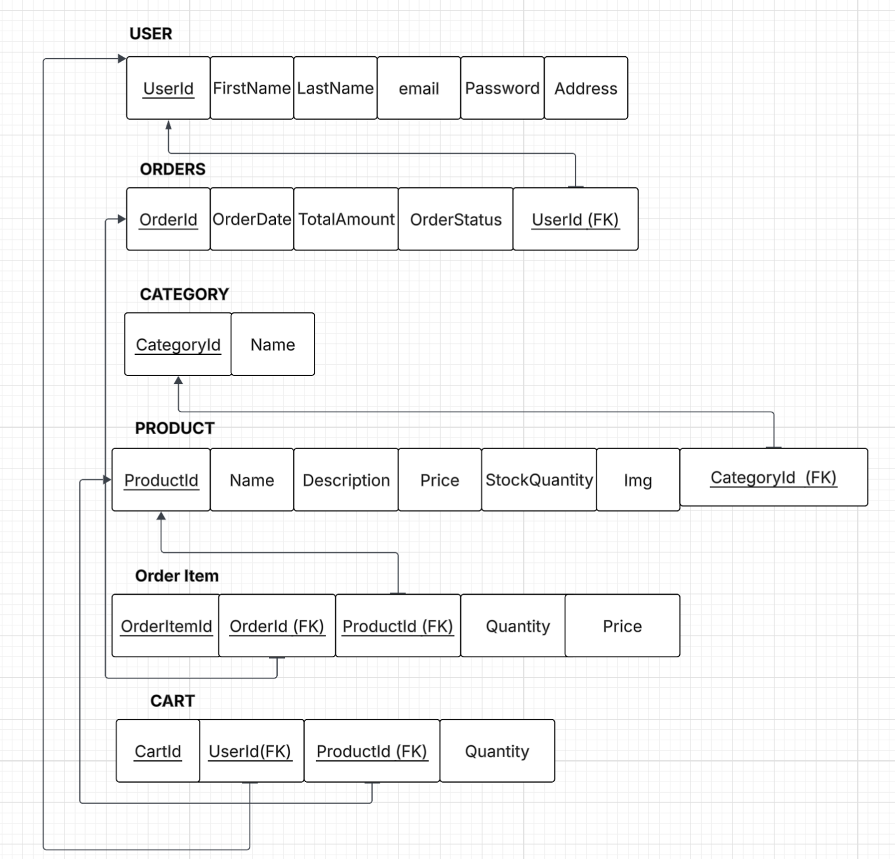

# Web Development Project

## Project Description
For my project, I am creating an online shopping website for multivitamins. Users will be able to register, 
log in, or continue as a guest to browse products.
The main page will include navigation bars such as Home, Register/Login, and Continue as Guest. 
If the user selects guest access, they will be directed to the product page.
On the product page, I have added two product images for now with options to select quantity and add items to the cart.
 There will be separate sections for men’s and women’s multivitamins.
My goal is to design a complete e-business layout that can later be expanded and possibly used in the future.

## Entity Relationship Diagram (ERD)

## Business Rules

# Database Project

## Project Description
For my project, I am creating an online shopping website for multivitamins. Users will be able to register, 
log in, or continue as a guest to browse products.
The main page will include navigation bars such as Home, Register/Login, and Continue as Guest. 
If the user selects guest access, they will be directed to the product page.
On the product page, I have added two product images for now with options to select quantity and add items to the cart.
 There will be separate sections for men’s and women’s multivitamins.
My goal is to design a complete e-business layout that can later be expanded and possibly used in the future.
## Entity Relationship Diagram (ERD)

## Business Rules

## Relations
This project features an online shopping database.
The USER table stores addresses in separate fields.
PRODUCTs are linked to CATEGORY for easy catalog organization.
CART and ORDER_ITEM tables manage the many-to-many relationships between users, orders, and products.
ORDER_ITEM records the product price at purchase time, ensuring historical orders remain accurate even if product prices change later.
The database follows Third Normal Form (3NF) principles to eliminate redundancy and maintain data integrity.

